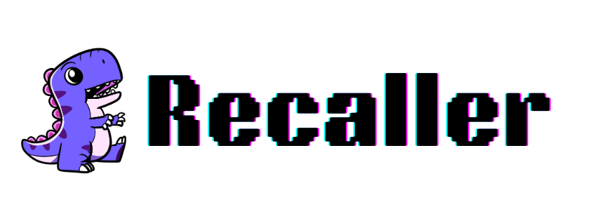

# Recaller



> **Blazing-fast command history search with instant documentation and terminal execution**

Recaller is an intelligent command-line tool that revolutionizes how you interact with your shell history. No more cycling through endless `Ctrl+R` searches or forgetting complex commands. Access your most frequent commands with lightning speed, view documentation instantly, and execute commands directly in new terminal tabs.

[](https://golang.org/dl/)
[](#license)
[](#supported-platforms)

## ✨ Features

### 🔍 **Smart History Search**
- **Frequency & Recency Based**: Commands ranked by how often and recently you use them
- **Real-time Search**: Instant filtering as you type with debounced search
- **Fuzzy Matching**: Find commands even with partial or approximate text

### 📚 **Integrated Documentation**
- **Instant Help**: View man pages, command help, and documentation without leaving the interface
- **Cached Results**: Smart caching for lightning-fast repeated lookups
- **Multiple Sources**: Supports `man`, `--help`, Git commands, and more

### ⚡ **Terminal Integration**
- **Copy to Clipboard**: Instant clipboard copy with visual confirmation
- **Direct Execution**: Execute commands directly in new terminal tabs/windows
- **Cross-Platform**: Works on both macOS and Linux with platform-specific optimizations

### 🎨 **Beautiful Terminal UI**
- **Elegant Interface**: Clean, responsive terminal UI built with termui
- **Keyboard Shortcuts**: Extensive keyboard navigation and shortcuts
- **Split Panels**: Separate panels for search, history, and documentation
- **Visual Feedback**: Color-coded interface with clear status indicators

## 🚀 Quick Start

### Installation

#### Option 1: Install Script (Recommended)
```bash
# Install the latest release automatically
curl -sf https://raw.githubusercontent.com/cybrota/recaller/refs/heads/main/install.sh | sh
```

#### Option 2: Download Binary
```bash
# Download and extract the latest release for your platform
PLATFORM=$(uname -s)
ARCH=$(uname -m | sed 's/x86_64/x86_64/; s/aarch64/arm64/')
curl -L https://github.com/cybrota/recaller/releases/latest/download/recaller_${PLATFORM}_${ARCH}.zip -o recaller.zip
unzip recaller.zip
chmod +x recaller
sudo mv recaller /usr/local/bin/
rm recaller.zip
```

#### Option 3: Build from Source
```bash
# Prerequisites: Go 1.18+
git clone https://github.com/cybrota/recaller.git
cd recaller
go build -o recaller .
sudo mv recaller /usr/local/bin/
```

### Basic Usage

```bash
# Launch interactive search interface
recaller

# Or use the default run command
recaller run

# View command history with filtering
recaller history --match "git"

# Show usage guide
recaller usage

# Check version
recaller version
```

## ⌨️ Keyboard Shortcuts

| Shortcut | Action |
|----------|--------|
| `Enter` | 📋 Copy selected command to clipboard |
| `Ctrl+E` | ⚡ Execute command in new terminal tab |
| `Ctrl+R` | 🔄 Reset/clear input |
| `Tab` | 🔄 Switch between panels (search ↔ help) |
| `↑/↓` | 📍 Navigate through commands/help text |
| `Ctrl+U` | ✏️ Insert selected command into input |
| `Ctrl+J/K` | ⏭️ Jump to first/last item |
| `F1` | 📖 Show help for selected command |
| `Ctrl+Z` | 📋 Copy help text to clipboard |
| `Esc` | ❌ Quit application |

## 🖥️ Cross-Platform Support

### macOS
- **Terminal.app**: Full AppleScript integration with tab management
- **iTerm2**: Native session and tab creation
- **Automatic Detection**: Seamlessly switches between terminal applications

### Linux
**Supported Terminal Emulators:**
- GNOME Terminal (`gnome-terminal`)
- KDE Konsole (`konsole`) 
- XFCE Terminal (`xfce4-terminal`)
- Tilix (`tilix`)
- Terminator (`terminator`)
- Alacritty (`alacritty`)
- Kitty (`kitty`)
- XTerm (`xterm`)

**Auto-Detection**: Automatically detects and uses available terminal emulators in order of preference.

## 🔧 Requirements

### System Requirements
- **Operating System**: macOS 10.12+ or Linux (most distributions)
- **Go Version**: 1.18+ (for building from source)
- **Memory**: Minimal (<10MB runtime)

### Dependencies

#### macOS
- No additional dependencies required

#### Linux
**For clipboard functionality:**
```bash
# Ubuntu/Debian
sudo apt install xclip

# CentOS/RHEL/Fedora  
sudo yum install xclip
# or
sudo dnf install xclip

# Arch Linux
sudo pacman -S xclip
```

## 🔍 How It Works

1. **History Analysis**: Scans your shell history (`~/.bash_history`, `~/.zsh_history`)
2. **Smart Ranking**: Uses an AVL tree data structure for efficient frequency/recency scoring
3. **Real-time Search**: Provides instant search results with optimized string matching
4. **Documentation Lookup**: Caches command documentation for fast access
5. **Platform Integration**: Uses native APIs (AppleScript on macOS, terminal commands on Linux)

## 🎯 Use Cases

- **DevOps Engineers**: Quickly recall complex `kubectl`, `terraform`, `aws` commands
- **Developers**: Access frequent `git`, `docker`, `npm` commands instantly  
- **System Administrators**: Find system administration commands efficiently
- **Power Users**: Navigate command-line workflows with speed and confidence

## 🔄 Shell Support

| Shell | History File | Support |
|-------|--------------|---------|
| **Bash** | `~/.bash_history` | ✅ Full |
| **Zsh** | `~/.zsh_history` | ✅ Full |
| **Fish** | Custom format | 🔄 Planned |
| **Other** | Generic | 🔄 Planned |

## 🤝 Contributing

We welcome contributions! Here's how you can help:

### Development Setup
```bash
git clone https://github.com/cybrota/recaller.git
cd recaller
go mod tidy
go run . # Test your changes
```

### Areas for Contribution
- **New Terminal Emulators**: Add support for additional Linux terminals
- **Shell Support**: Extend support to Fish, PowerShell, etc.
- **Documentation**: Improve help text and documentation sources
- **Performance**: Optimize search algorithms and caching
- **Testing**: Add comprehensive test coverage

### Submitting Changes
1. Fork the repository
2. Create a feature branch (`git checkout -b feature/amazing-feature`)
3. Commit your changes (`git commit -m 'Add amazing feature'`)
4. Push to the branch (`git push origin feature/amazing-feature`)
5. Open a Pull Request

## 📝 License

Licensed under the Apache License, Version 2.0 (the "License");
you may not use this file except in compliance with the License.
You may obtain a copy of the License at

    http://www.apache.org/licenses/LICENSE-2.0

Unless required by applicable law or agreed to in writing, software
distributed under the License is distributed on an "AS IS" BASIS,
WITHOUT WARRANTIES OR CONDITIONS OF ANY KIND, either express or implied.
See the License for the specific language governing permissions and
limitations under the License.

Copyright © 2025 [Naren Yellavula](https://github.com/narenaryan)

## 👨‍💻 Author

**Naren Yellavula**
- GitHub: [@narenaryan](https://github.com/narenaryan)
- Website: [https://github.com/narenaryan](https://github.com/narenaryan)

## 🙏 Acknowledgments

- Built with [termui](https://github.com/gizak/termui) for the beautiful terminal interface
- Uses [clipboard](https://github.com/atotto/clipboard) for cross-platform clipboard support
- Inspired by the need for better command-line productivity tools

---

<div align="center">

**Star ⭐ this repository if you find it useful!**

[Report Bug](https://github.com/cybrota/recaller/issues) · [Request Feature](https://github.com/cybrota/recaller/issues) · [Documentation](https://github.com/cybrota/recaller/wiki)

</div>
